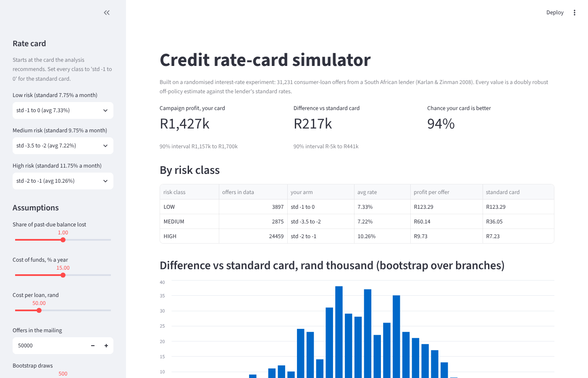
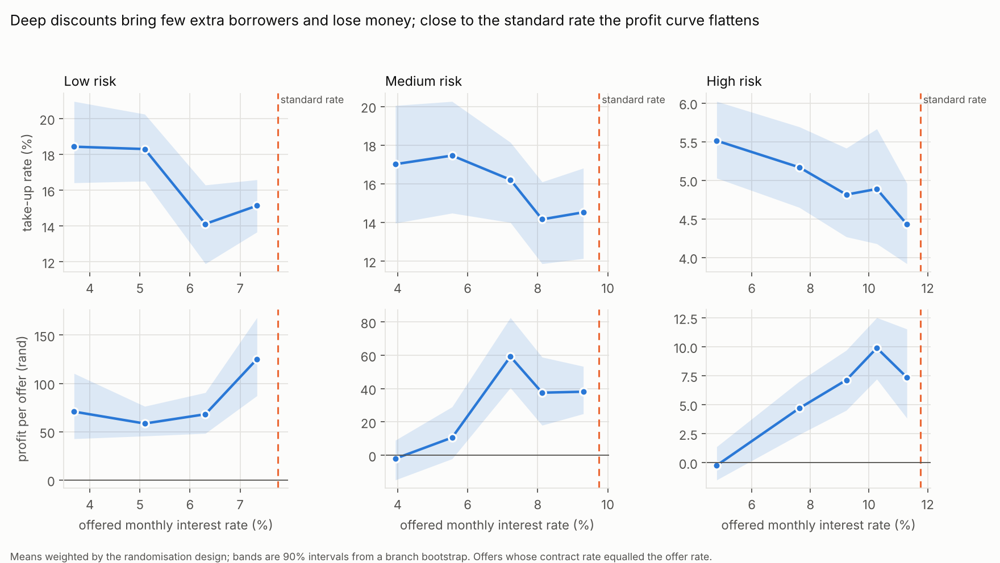
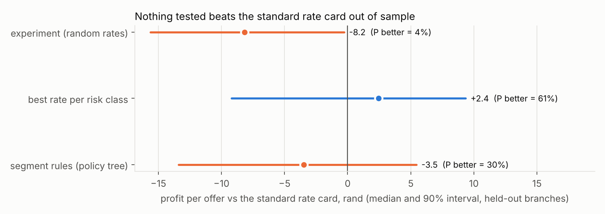
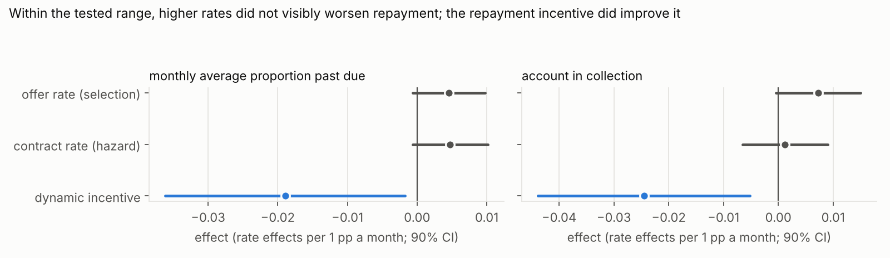
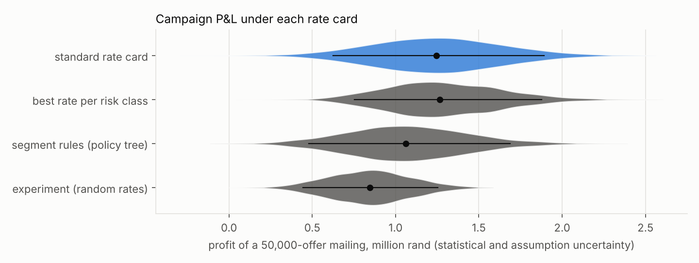

# Credit Pricing Lab

**Should a consumer lender change its interest rates, and for whom?** This lab answers that with a real randomised experiment: 53,810 loan offers from a South African lender whose monthly interest rates were assigned by lottery (Karlan & Zinman 2008, 2009).

Because prices were random, demand, revenue and repayment responses are causal, not correlations. The lab uses them to build and test rate cards the way a pricing team would.

The work runs in six steps:

1. Replicate the published results.
2. Measure unit economics at each price.
3. Learn candidate rate cards.
4. Score the cards on branches they never saw, with doubly robust off-policy evaluation.
5. Turn the scores into a campaign P&L under statistical and economic uncertainty.
6. Expose it all in an interactive simulator.



## Findings

**1. Every published number reproduces exactly.** Six estimates from the AER paper match to the printed coefficient, standard error and sample size: take-up, loan size, interest revenue and past due. Nothing below is built on numbers that do not first reproduce.

**2. Discounts do not pay for themselves.** A 1-point cut in the monthly rate raises applications by only 0.29 points, on a base of about 8%.

| Risk class | Offered rate | Profit per offer |
|---|---|---|
| High risk | 11.3% (near standard) | R7.35 |
| High risk | 4.8% | -R0.24 |
| Low risk | 7.3% (near standard) | R125 |
| Low risk | 3.7% | R71 |

The experiment's own mix of discounted rates earned **R8.16 less per offer than the standard rate card**, a 96% probability of being worse. On a 50,000-offer mailing that is about R394k given up.

**3. The standard rate sits on a kink.** Above it, applications fall six times faster: 1.72 points per 1-point increase, against 0.29 below it. Rates above standard were tested in only 632 first-wave offers, so a price rise cannot be evaluated responsibly from this data. That is the experiment to run next.

**4. Within the tested range, price did not visibly change risk.** The Econometrica design randomises the offer rate and, separately, the contract rate:

- **Offer rate (selection).** Higher rates did not detectably attract worse borrowers.
- **Contract rate (hazard).** Higher rates did not detectably make the same borrowers repay worse.
- **Repayment incentive.** Keeping the low rate for clients who repay did work: accounts in collection fell by 2.4 points from an 11.8% base, about a fifth. That is a non-price lever worth more than any rate change tested here.

**5. Out of sample, nothing beats the standard card.** Each candidate card was learned on half the branches and scored on the other half, over 20 random splits:

| Rate card | vs standard, per offer (90% interval) | Chance it beats standard |
|---|---|---|
| Random rates (the experiment itself) | **-R8.16** (-15.63 to -0.29) | 4% |
| Best single rate per risk class | +R2.44 (-9.21 to +9.34) | 61% |
| Segment rules (depth-2 policy trees on credit features) | -R3.48 (-13.41 to +5.45) | 30% |

Personalised pricing on these features did not generalise. This is a finding about the data, not a failing of the method: on semi-synthetic data with a planted segment effect, the same trees find the segment and the held-out evaluation shows the gain (`tests/test_policy_semisynthetic.py`).

**6. The winner's curse, measured.** Scored on the same data that chose it, the recommended card looks like **+R217k per mailing with 94% confidence** (the simulator's default view). On held-out branches it is +R66k with 60%. The held-out number is the one to plan on, and the gap is why a learned card should be tested before rollout.

**Recommendation.**

- Keep the standard card and stop broad discounting.
- Test small cuts for medium and high risk only as experimental arms.
- Run the next experiment above the standard rate, where the evidence is thinnest.
- Scale the repayment incentive.






Full tables: [reports/results.md](reports/results.md).

## Method

```
data.py        checks on load: 53,810 offers, rate ranges, contract rate <= offer rate, no revenue without a loan, ...
replicate.py   AER 2008 Tables 3-5 against the printed values; Econometrica 2009 Table 1 specification
curves.py      unit economics per risk class x price arm, weighted by the design, branch bootstrap
policy.py      doubly robust scores, cross-fitted by branch; depth-2 policy trees; rate-card assignment
evaluate.py    repeated branch splits: learn on half, score on the other half, bootstrap branches
pnl.py         campaign P&L: policy-value draws x economic-assumption draws, paired against the standard card
```

- **Profit is kept as components:** revenue, past due, balance-months and loans. The assumptions the data cannot supply then enter linearly and can be changed without refitting: the share of past due lost, the cost of funds, the average balance and the cost per loan. Each one is varied in the Monte Carlo, and a sensitivity table shows which ones can flip a decision.
- **Doubly robust off-policy evaluation:**

  `G(a) = m(x, a) + 1[A = a] / e(a | risk, wave) · (Y - m(x, A))`

  The propensity `e` is known by design, because rates were randomised within risk class and wave. The outcome model `m` is gradient boosting, always fitted on other branches.
- **Inference respects the clustering.** Offers in one branch are not independent, so every interval comes from resampling whole branches. Repeated sample splits add the variation that comes from the choice of split.
- **Pricing features exclude protected or proxy attributes.** Policies may use credit scores, income, relationship history and the last loan. Gender, marital status, location type and education are left out.
- **Revenue is evaluated only on offers whose contract rate equalled the offer.** A separate random draw cut some contract rates after application. This is the same restriction the paper uses, and it is still a random sample.

## Validation

15 automated tests cover the following:

- the replication of every published estimate;
- the loader rejecting corrupted data;
- the doubly robust estimator reducing to IPW with a zero outcome model, and to the model itself when the model is perfect;
- assignment rules and missing-value handling;
- the paired campaign P&L;
- **a semi-synthetic test bed**: real offers, covariates and randomised arms, with outcomes drawn from a known model. The estimator recovers the true value of every fixed rate card within R1.50, the policy tree recovers a planted segment rule for over 80% of clients, and the held-out evaluation detects its gain.

## Limitations

- **The setting.** These are high-cost microloans from 2003 South Africa, at monthly rates of 3% to 12%. The method transfers; the magnitudes do not.
- **Losses are a proxy.** Past due in months 7 to 12 stands in for losses, and funding and servicing costs are assumptions. Ranges and the sensitivity table are in `results.md`. The best-card advantage turns negative if only 60% of past due is lost.
- **The intervals are wide.** Take-up is about 7%, so profit per offer is noisy, and branch-level uncertainty is real.
- **The price space is limited.** Prices are grouped into five arms below the standard rate; above-standard prices are out of scope.
- **One table is unchecked.** The Econometrica table is reproduced from the authors' specification; its printed values were not available to compare against.

## Run it

```bash
pip install -e ".[app,dev]"
python -m creditlab.pipeline        # about 2.5 minutes; --quick for a fast check
python -m creditlab.report
pytest -q
streamlit run app/streamlit_app.py
```

The AER data is included under its CC BY 4.0 licence. For the Econometrica file, see [data/README.md](data/README.md); without it, that section is skipped.

## Data and credit

- Karlan, D. S., & Zinman, J. (2008). Credit Elasticities in Less-Developed Economies: Implications for Microfinance. *American Economic Review*, 98(3). Data: https://doi.org/10.3886/E113240V1 (CC BY 4.0).
- Karlan, D., & Zinman, J. (2009). Observing Unobservables: Identifying Information Asymmetries With a Consumer Credit Field Experiment. *Econometrica*, 77(6).
- Method references: Dudík, Langford & Li (2011), doubly robust policy evaluation; Athey & Wager (2021), policy learning with observational data.

Code: MIT.
